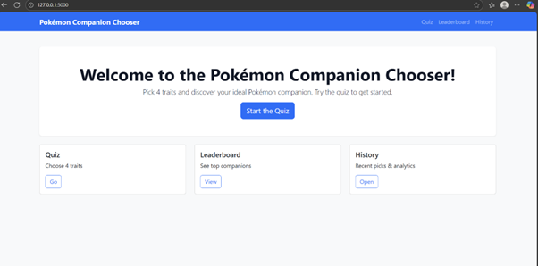
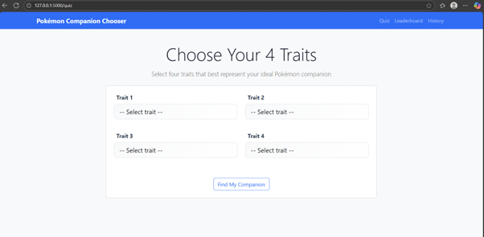
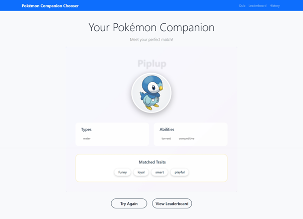
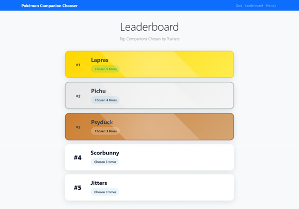
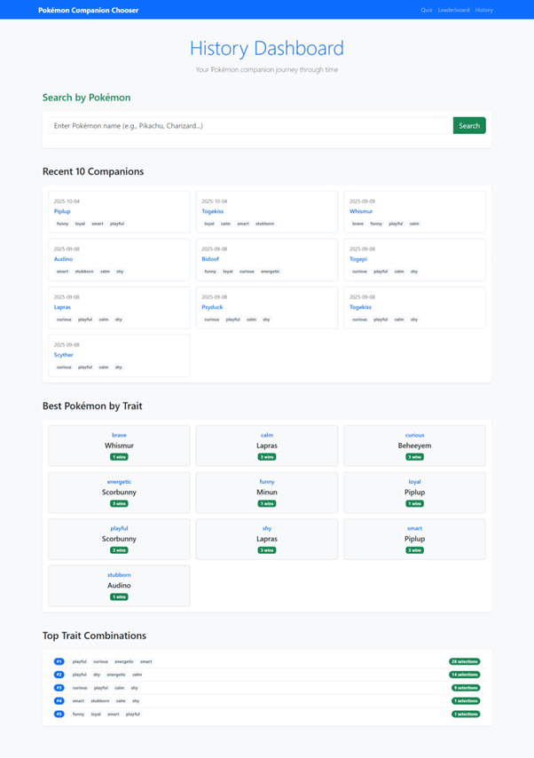

# Pokémon Companion Quiz App

A Flask-based interactive quiz application that helps users discover their ideal Pokémon companion based on selected personality traits. The app provides instant results, a global leaderboard, and a personal history dashboard, all powered by a MongoDB backend.

***

## 📌 Project Overview

This project is a **Flask-based Quiz Application** empowering users to take quizzes, view instant results, and track their progress. It features:

- Dynamic **Pokémon recommendation system**
- **Leaderboard** for popular Pokémon
- **History dashboard** for last 10 quiz attempts
- Modern UI via **HTML, CSS, JavaScript, Bootstrap, Jinja2**
- Robust **MongoDB** backend for quiz data, history, and leaderboard

***

## 🚀 Key Features

### 1. Quiz System

- Users select **4 personality traits**
- System recommends Pokémon companion via trait-to-Pokémon mapping
- All mappings managed with **MongoDB**

### 2. Result Page

- Displays:
  - Selected Pokémon  
  - Types  
  - Abilities  
  - Personality trait mapping

### 3. Leaderboard

- Shows **most popular Pokémon companions**
- Updates in real-time per quiz submissions

### 4. History Dashboard

- Lists the **latest 10 quiz attempts**
- Shows best Pokémon per trait for each user
- Highlights frequent trait combinations
- Includes Pokémon name search

### 5. MongoDB Integration

- Stores:
  - Trait mapping
  - Quiz history
  - Leaderboard stats
- Uses environment variables for configuration

### 6. Modern UI

- Renders dynamic content with **Jinja2**
- Styled by **Bootstrap** and custom CSS for responsive, clean layout

***

## 🖼️ Screenshots

### Home Page


### Quiz Page


### Result Page


### Leaderboard


### Leaderboard


***

## ⚙️ Installation & Setup

### 1. Clone the Repository

```bash
git clone https://github.com/GreenThenics/pokemon-companion-app.git
cd pokemon-companion-app
```


### 2. Set Up Virtual Environment

```bash
python -m venv venv
# Activate for Windows
venv\Scripts\activate
# Activate for macOS/Linux
source venv/bin/activate
```


### 3. Install Dependencies

```bash
pip install -r requirements.txt
```


### 4. Configure Environment Variables

Create a `.env` file in the project root:

```env
MONGO_URI=your-mongodb-uri
DB_NAME=pokemon_companion_db
```


### 5. Run the App

```bash
flask run
```